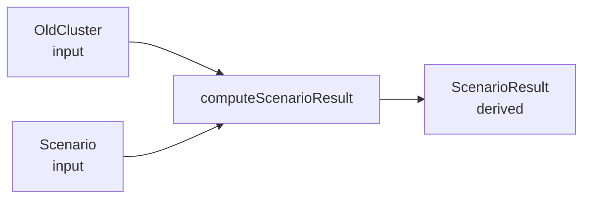
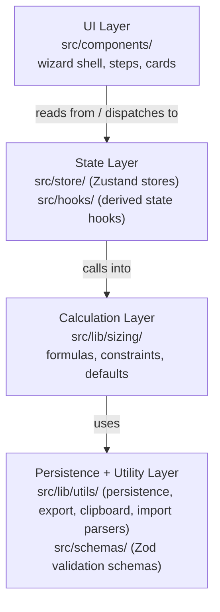

# Presizion -- Architecture Document

## 1. System Overview

Presizion is a client-side-only static web application for presales engineers to size refreshed server clusters based on existing cluster metrics. There is no backend, no API, and no server-side logic. All calculations run entirely in the browser.

- **Framework**: React 19 + TypeScript (strict mode), built with Vite 8
- **Styling**: Tailwind CSS 4 + shadcn/ui component primitives
- **State management**: Zustand 5 (multiple independent stores)
- **Form handling**: React Hook Form 7 + Zod 4 validation schemas
- **Charts**: Recharts 2
- **Deployment**: Static files served from a `/presizion/` base path (configured in `vite.config.ts`), suitable for GitHub Pages or any static web server

The application has zero runtime server dependencies. File imports (RVTools, LiveOptics) are parsed client-side using the `@e965/xlsx` library and JSZip.

## 2. Data Flow

The core data model follows a three-entity pipeline where results are always derived, never stored:



### Entities

| Entity | Role | Where defined |
|--------|------|---------------|
| `OldCluster` | Current environment metrics (vCPUs, pCores, VMs, disk, server config, utilization) | `src/types/cluster.ts` |
| `Scenario` | Target server configuration + sizing assumptions (cores, RAM, disk per server, ratios, headroom) | `src/types/cluster.ts` |
| `ScenarioResult` | Computed output: server counts per constraint, limiting resource, utilization metrics | `src/types/results.ts` |

### Derive-on-read pattern

`ScenarioResult` is never stored in any Zustand store. It is computed on demand by the `useScenariosResults` hook, which reads `currentCluster` from `useClusterStore`, `scenarios[]` from `useScenariosStore`, and `sizingMode`/`layoutMode` from `useWizardStore`, then maps each scenario through `computeScenarioResult()`. Every React render that calls this hook gets fresh results derived from current state.

## 3. Layer Architecture

The application is organized into four layers with strict dependency rules: each layer may only import from layers below it.



### Layer responsibilities

- **UI Layer**: Presentational React components. No inline calculations. Components read state via Zustand hooks and dispatch actions via store methods.
- **State Layer**: Zustand stores hold mutable application state. The `useScenariosResults` hook bridges state and calculation layers.
- **Calculation Layer**: Pure functions that compute server counts and utilization metrics. No React imports, no side effects, no state access.
- **Persistence + Utility Layer**: localStorage read/write, URL hash encoding/decoding, CSV/JSON export builders, file import parsers, Zod schemas for form validation.

## 4. Store Architecture

Five independent Zustand stores, each with a single responsibility:

### useClusterStore (`src/store/useClusterStore.ts`)

Holds the `OldCluster` object representing the existing environment metrics entered in Step 1.

| Action | Purpose |
|--------|---------|
| `setCurrentCluster(cluster)` | Replace cluster data (after form submit or file import) |
| `resetCluster()` | Reset to empty initial state (all zeros) |

### useScenariosStore (`src/store/useScenariosStore.ts`)

Holds the `Scenario[]` array for Step 2. Initialized with one default scenario.

| Action | Purpose |
|--------|---------|
| `addScenario(overrides?)` | Append a new scenario with defaults, optionally overridden |
| `duplicateScenario(id)` | Clone a scenario with a new UUID and "(copy)" suffix |
| `removeScenario(id)` | Delete a scenario by ID |
| `updateScenario(id, partial)` | Merge partial updates into a scenario |
| `setScenarios(scenarios)` | Replace entire list (used by session import/restore) |
| `seedFromCluster(cluster)` | Propagate avg VM sizes from imported cluster data to all scenarios |

### useWizardStore (`src/store/useWizardStore.ts`)

Controls wizard navigation and global sizing parameters.

| State | Purpose |
|-------|---------|
| `currentStep` (1, 2, or 3) | Active wizard step |
| `sizingMode` | CPU formula selection: `vcpu`, `specint`, `aggressive`, `ghz` |
| `layoutMode` | Disk constraint toggle: `hci` (disk counted) or `disaggregated` (disk excluded) |

### useThemeStore (`src/store/useThemeStore.ts`)

Manages light/dark/system theme preference. Persists to `localStorage` under the key `presizion-theme`. Applies the `dark` CSS class to `document.documentElement` immediately on change.

### useImportStore (`src/store/useImportStore.ts`)

Holds intermediate state during file import: raw parsed data grouped by scope (cluster/datacenter), scope labels, and the currently active scope selection. When `setActiveScope` is called, it aggregates the selected scopes and pushes the result into `useClusterStore`.

## 5. Component Hierarchy

The application renders a single-page 3-step wizard:

```text
App
  WizardShell
    ThemeToggle
    SizingModeToggle (sizing mode + layout mode selectors)
    StepIndicator (step 1/2/3 progress)
    |
    +-- Step 1: Step1CurrentCluster
    |     CurrentClusterForm (react-hook-form + Zod validation)
    |     DerivedMetricsPanel (computed preview metrics)
    |     FileImportButton --> ImportPreviewModal (scope selection)
    |     ScopeBadge (active scope indicator)
    |
    +-- Step 2: Step2Scenarios
    |     Tabs (one tab per scenario)
    |       ScenarioCard (react-hook-form per scenario)
    |       ScenarioResults (live preview of sizing result)
    |     "Add Scenario" button
    |
    +-- Step 3: Step3ReviewExport
          ComparisonTable (side-by-side scenario comparison)
          SizingChart (Recharts bar chart)
          CoreCountChart (Recharts chart)
          Export buttons: Copy Summary, Download CSV, Download JSON, Share
```

### Wizard navigation

- Step 1 form submit advances to Step 2 via `useWizardStore.nextStep()`
- Step 2 has a "Next: Review & Export" button
- Steps 2 and 3 have a "Back" button
- `StepIndicator` renders a visual progress bar
- `useBeforeUnload` warns the user before navigating away when past Step 1

## 6. Calculation Engine

All sizing logic lives in `src/lib/sizing/`. It is split into two files:

### formulas.ts -- Pure math functions

Six standalone functions, each computing the server count required by a single constraint:

| Function | Formula ID | When used |
|----------|-----------|-----------|
| `serverCountByCpu` | CALC-01 | `sizingMode === 'vcpu'` (default) |
| `serverCountBySpecint` | CALC-SPECint | `sizingMode === 'specint'` |
| `serverCountByCpuAggressive` | CALC-01-AGG | `sizingMode === 'aggressive'` |
| `serverCountByGhz` | CALC-01-GHZ | `sizingMode === 'ghz'` |
| `serverCountByRam` | CALC-02 | Always active |
| `serverCountByDisk` | CALC-03 | Active when `layoutMode === 'hci'` |

Each function receives raw numeric parameters and returns `Math.ceil(...)`. No intermediate rounding is performed.

### constraints.ts -- Orchestrator

`computeScenarioResult(cluster, scenario, sizingMode, layoutMode)` is the single public entry point. It:

1. Computes `headroomFactor = 1 + headroomPercent / 100`
2. Computes `coresPerServer = socketsPerServer * coresPerSocket`
3. Resolves effective VM/vCPU counts (scaled when `targetVmCount` overrides `totalVms`)
4. Dispatches to the appropriate CPU formula based on `sizingMode` (CALC-01)
5. Computes RAM-limited count (CALC-02) with optional utilization right-sizing
6. Computes disk-limited count (CALC-03), or 0 in disaggregated mode
7. Determines the limiting resource (CALC-05): whichever constraint yields the highest count. Tie-breaking priority: cpu/specint/ghz > ram > disk
8. Adds HA reserve servers (CALC-04): 0, 1, or 2 extra servers
9. Applies `minServerCount` floor pin
10. Computes utilization metrics (CALC-06): achieved vCPU:pCore ratio, VMs/server, CPU/RAM/disk utilization percentages

The returned `ScenarioResult` is `Object.freeze()`-d to enforce immutability.

### defaults.ts -- Industry-standard constants

Provides `createDefaultScenario()` which returns a fully populated `Scenario` with sensible defaults (2-socket / 16-core / 512 GB RAM / 10 TB disk, 4:1 vCPU ratio, 20% headroom, no HA reserve). Default hardware profile is based on the Dell PowerEdge R660 with Intel Xeon Gold 6526Y processors.

## 7. Persistence

### localStorage (automatic)

- **Storage key**: `presizion-session`
- **Auto-save**: `main.tsx` subscribes to all three primary stores (`useClusterStore`, `useScenariosStore`, `useWizardStore`). Every state change triggers `saveToLocalStorage()` synchronously.
- **Boot restore**: On application load (before React mounts), `main.tsx` reads from localStorage and hydrates all stores.
- **Schema validation**: `persistence.ts` uses a Zod `sessionSchema` to validate stored data on read. Malformed or outdated sessions are silently discarded (returns `null`).

### URL hash encoding (shareable sessions)

- `encodeSessionToHash(data)` serializes `SessionData` to a base64url-encoded JSON string
- `decodeSessionFromHash(hash)` reverses the encoding and validates with Zod
- **Boot priority**: URL hash takes precedence over localStorage. If a hash is present at boot, it is decoded and used; the hash is then cleared via `history.replaceState()` so subsequent refreshes use localStorage.
- **Share button**: Step 3 generates a shareable URL containing the full session state in the hash fragment and copies it to the clipboard.

### Session data shape

```typescript
interface SessionData {
  cluster: OldCluster;
  scenarios: Scenario[];
  sizingMode: SizingMode;   // 'vcpu' | 'specint' | 'aggressive' | 'ghz'
  layoutMode: LayoutMode;   // 'hci' | 'disaggregated'
}
```

## 8. File Import Pipeline

The import system (`src/lib/utils/import/`) supports three source formats:

| Format | File types | Parser |
|--------|-----------|--------|
| RVTools | `.xlsx` | `rvtoolsParser.ts` |
| LiveOptics | `.xlsx`, `.csv` | `liveopticParser.ts` |
| Presizion JSON | `.json` | `jsonParser.ts` |

The `importFile()` entry point:

1. Validates the file (size, extension, magic bytes)
2. Auto-detects the format via `formatDetector.ts`
3. Dispatches to the appropriate parser
4. Returns a `ClusterImportResult` with parsed metrics and optional scope data

When multiple scopes (clusters/datacenters) are detected, `useImportStore` holds the raw data and `scopeAggregator.ts` combines selected scopes before pushing into `useClusterStore`.

A `columnResolver.ts` module handles column name normalization across different tool versions and languages.

## 9. Validation Architecture

Form validation uses Zod schemas (`src/schemas/`) integrated with React Hook Form via `@hookform/resolvers`:

- `currentClusterSchema` -- validates Step 1 cluster input. Required fields: `totalVcpus`, `totalPcores`, `totalVms` (non-negative integers). Optional fields for server config, utilization percentages, and benchmark scores.
- `scenarioSchema` -- validates Step 2 scenario input. All server spec fields are required positive numbers. Default values for ratio, headroom, and HA reserve are imported from `defaults.ts`.

Both schemas use `z.preprocess()` to convert HTML form string values to numbers, rejecting empty strings as validation errors rather than silently coercing to zero.

## 10. Export Capabilities

Step 3 provides four export actions:

| Action | Module | Output |
|--------|--------|--------|
| Copy Summary | `clipboard.ts` | Plain-text summary to clipboard |
| Download CSV | `export.ts` | RFC 4180-compliant CSV file |
| Download JSON | `export.ts` | Pretty-printed JSON (schema v1.1 with metadata) |
| Share | `persistence.ts` | URL with base64url-encoded session in hash fragment |

All export functions are pure (except the DOM interaction for triggering downloads) and receive cluster, scenarios, and results as parameters.

## 11. Key Design Principles

1. **Derive-on-read**: `ScenarioResult` is never cached in state. It is recomputed from `OldCluster` + `Scenario` on every render via `useScenariosResults()`. This eliminates stale-data bugs and keeps stores minimal.

2. **Functional first**: All sizing functions are pure -- no side effects, no mutations, no state access. The `ScenarioResult` object is frozen after creation.

3. **No `any`**: TypeScript strict mode is enforced. Interfaces define object shapes; type aliases define unions and function signatures.

4. **Immutable state updates**: Zustand stores use spread-based immutable updates. No direct mutation of state objects.

5. **Separation of concerns**: Calculations are centralized in `src/lib/sizing/` and never inlined in components. UI components are purely presentational over the store and hook outputs.

6. **Schema-driven validation**: Zod schemas are the single source of truth for input validation. They are shared between form validation and persistence deserialization.

7. **Fail-safe persistence**: All localStorage and URL hash operations are wrapped in try/catch. Corrupted or incompatible sessions are silently discarded rather than crashing the application.

8. **Single responsibility stores**: Each Zustand store owns one concern (cluster data, scenarios, wizard navigation, theme, import buffer). Stores are composed at the hook/component level, not nested.
