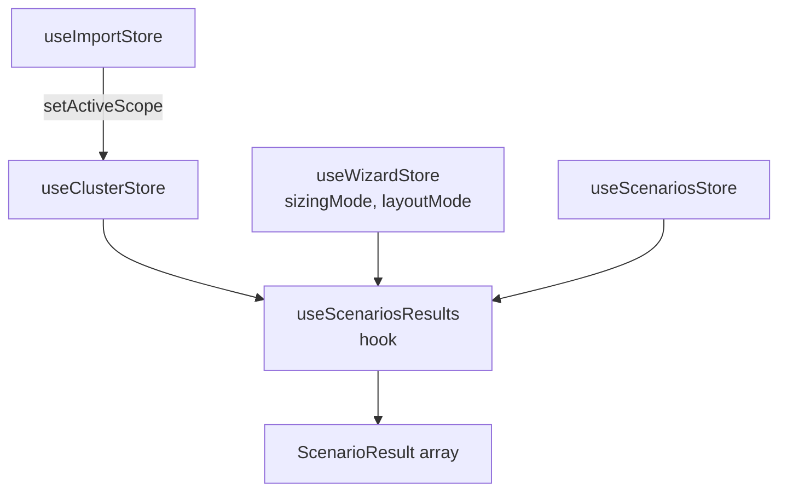

# State Management

Presizion uses [Zustand](https://github.com/pmndrs/zustand) for client-side state management. All state lives in the browser -- there is no backend. This document describes every store, the derive-on-read pattern for computed results, the persistence layer, URL hash sharing, and schema validation.

---

## 1. Store Overview

| Store | File | Responsibility |
|---|---|---|
| `useClusterStore` | `src/store/useClusterStore.ts` | Holds the existing cluster metrics (`OldCluster`) entered in wizard Step 1. |
| `useScenariosStore` | `src/store/useScenariosStore.ts` | Holds the list of target `Scenario[]` objects configured in wizard Step 2. |
| `useWizardStore` | `src/store/useWizardStore.ts` | Tracks the current wizard step (1--3), the active `SizingMode`, and the active `LayoutMode`. |
| `useThemeStore` | `src/store/useThemeStore.ts` | Manages the UI theme (`light`, `dark`, `system`). Persisted independently under the `presizion-theme` localStorage key. |
| `useImportStore` | `src/store/useImportStore.ts` | Transient buffer for imported file data (RVTools, LiveOptics). Holds raw per-scope data and the active scope selection. Not persisted. |

### What is NOT a store

`ScenarioResult` (the sizing output) is never stored. It is derived on every render by the `useScenariosResults` hook. See section 3.

---

## 2. Store Patterns

### Immutable Updates

All store mutations produce new objects via spread syntax. No store mutates existing state in place.

```ts
// useScenariosStore.updateScenario
scenarios: state.scenarios.map((s) =>
  s.id === id ? { ...s, ...partial } : s,
)
```

All type interfaces (`OldCluster`, `Scenario`, `ScenarioResult`) declare every field as `readonly`.

### Partial State

Zustand's `set()` performs a shallow merge by default. Stores exploit this by passing only the changed slice:

```ts
set({ currentCluster: cluster })   // merges into ClusterStore
set({ sizingMode: mode })           // merges into WizardStore
```

### Selectors

Components subscribe to individual fields via inline selectors to minimize re-renders:

```ts
const currentCluster = useClusterStore((state) => state.currentCluster);
const scenarios = useScenariosStore((state) => state.scenarios);
const sizingMode = useWizardStore((state) => state.sizingMode);
```

Zustand uses `Object.is` equality by default, so selecting a primitive or stable reference avoids unnecessary renders.

### Outside-React Access

Stores are accessed outside React (e.g., in `main.tsx` for boot restore and auto-save subscribers) via `useXxxStore.getState()`:

```ts
useClusterStore.getState().setCurrentCluster(saved.cluster);
```

The `useImportStore` also calls into `useClusterStore.getState()` from within its own `setActiveScope` action to push aggregated cluster data cross-store.

---

## 3. Derive-on-Read

**File:** `src/hooks/useScenariosResults.ts`

Sizing results are never cached in Zustand. The `useScenariosResults` hook reads from three stores and computes results on every render:

```ts
export function useScenariosResults(): readonly ScenarioResult[] {
  const currentCluster = useClusterStore((state) => state.currentCluster);
  const scenarios = useScenariosStore((state) => state.scenarios);
  const sizingMode = useWizardStore((state) => state.sizingMode);
  const layoutMode = useWizardStore((state) => state.layoutMode);

  return scenarios.map((scenario) =>
    computeScenarioResult(currentCluster, scenario, sizingMode, layoutMode),
  );
}
```

This guarantees results are always consistent with the current inputs. The computation is a pure function (`computeScenarioResult` in `src/lib/sizing/constraints.ts`) with no side effects.

---

## 4. Inter-Store Communication

The stores form a directed data flow:



### Key relationships

- **Import to Cluster:** `useImportStore.setActiveScope()` aggregates imported per-scope data and calls `useClusterStore.getState().setCurrentCluster()` directly. This is the only cross-store write in the codebase. As of v1.4, the aggregated cluster object includes `cpuModel` and `cpuFrequencyGhz` fields (when available from the import source), enabling the GHz sizing mode and SPECrate lookup immediately after import.

- **Cluster to Scenarios (seeding):** `useScenariosStore.seedFromCluster(cluster)` propagates imported cluster-level values (avgRamPerVmGb, diskPerVmGb, server hardware config) into all existing scenarios. This is called by the UI after import, not automatically by a store subscriber.

- **All stores to Results:** The `useScenariosResults` hook reads from `useClusterStore`, `useScenariosStore`, and `useWizardStore` to compute `ScenarioResult[]`. No store writes results back.

- **Theme:** `useThemeStore` is fully independent. It has its own localStorage key and no interaction with other stores.

---

## 5. Persistence Layer

**File:** `src/lib/utils/persistence.ts`

### SessionData

The persisted unit is a `SessionData` object containing the full application state minus theme and import buffer:

```ts
interface SessionData {
  cluster: OldCluster;
  scenarios: Scenario[];
  sizingMode: SizingMode;
  layoutMode: LayoutMode;
}
```

### localStorage Auto-Save

Configured in `src/main.tsx`. Three Zustand `subscribe()` calls fire a synchronous save on every state change:

```ts
const saveSession = () => {
  saveToLocalStorage({
    cluster: useClusterStore.getState().currentCluster,
    scenarios: useScenariosStore.getState().scenarios,
    sizingMode: useWizardStore.getState().sizingMode,
    layoutMode: useWizardStore.getState().layoutMode,
  });
};

useClusterStore.subscribe(saveSession);
useScenariosStore.subscribe(saveSession);
useWizardStore.subscribe(saveSession);
```

No debounce is applied -- session payloads are small enough that synchronous writes are acceptable.

### Storage Key

All session data is stored under a single key: `presizion-session`.

### Error Handling

All localStorage reads and writes are wrapped in try/catch. Failures (quota exceeded, private browsing restrictions, SecurityError) are silently ignored -- the app remains functional without persistence.

---

## 6. URL Hash Sharing

### Encoding

A Share button in Step 3 (`src/components/step3/Step3ReviewExport.tsx`) encodes the current session into a URL-safe base64 string appended as the URL hash:

```ts
const hash = encodeSessionToHash({ cluster, scenarios, sizingMode, layoutMode });
const url = `${window.location.origin}${window.location.pathname}#${hash}`;
```

The encoding uses base64url (RFC 4648 section 5): `+` becomes `-`, `/` becomes `_`, and padding `=` is stripped. The resulting URL is copied to the clipboard.

### Decoding

`decodeSessionFromHash(hash)` reverses the encoding. It accepts the hash with or without a leading `#`, restores standard base64, adds padding, decodes via `atob()`, and validates the result through the same `sessionSchema` used for localStorage.

### Boot Priority

Restore runs synchronously in `main.tsx` before React mounts:

1. **URL hash** -- `decodeSessionFromHash(window.location.hash)`. If present and valid, this wins.
2. **localStorage** -- `loadFromLocalStorage()`. Used when no hash is present.
3. **Blank state** -- empty cluster + one default scenario. Used when neither source has data.

After restoring from a hash, the URL hash is cleared via `history.replaceState()` so that subsequent page refreshes use localStorage (which will contain the just-restored session thanks to auto-save).

---

## 7. Schema Validation

All persisted data is validated through Zod schemas before it enters the stores.

### currentClusterSchema

**File:** `src/schemas/currentClusterSchema.ts`

- Required fields: `totalVcpus`, `totalPcores`, `totalVms` (non-negative integers).
- Optional fields: `totalDiskGb`, `socketsPerServer`, `coresPerSocket`, `ramPerServerGb`, `existingServerCount`, `specintPerServer`, `cpuUtilizationPercent`, `ramUtilizationPercent`, `cpuFrequencyGhz`.
- Uses `z.preprocess` (not `z.coerce.number`) so that empty strings produce a `ZodError` instead of silently coercing to 0.

### scenarioSchema

**File:** `src/schemas/scenarioSchema.ts`

- `id` must be a valid UUID.
- `name` is a non-empty string.
- Required numeric fields: `socketsPerServer`, `coresPerSocket`, `ramPerServerGb`, `diskPerServerGb`, `ramPerVmGb`, `diskPerVmGb` (all positive).
- Fields with defaults: `targetVcpuToPCoreRatio` (4), `headroomPercent` (20), `haReserveCount` (0), `targetCpuUtilizationPercent` (100), `targetRamUtilizationPercent` (100). Defaults are imported from `src/lib/sizing/defaults.ts`.
- Optional fields: `targetSpecint`, `targetVmCount`, `minServerCount`, `targetCpuFrequencyGhz`.

### sessionSchema (internal to persistence.ts)

Composes `currentClusterSchema` and `z.array(scenarioSchema)` with `sizingMode` and `layoutMode` enum fields (defaulting to `'vcpu'` and `'hci'` respectively for backward compatibility with older stored sessions).

### Validation Points

| Entry point | Schema used | Behavior on failure |
|---|---|---|
| Form submit (Step 1) | `currentClusterSchema` | Validation errors shown in the form UI |
| Form submit (Step 2) | `scenarioSchema` | Validation errors shown in the form UI |
| `loadFromLocalStorage()` | `sessionSchema` | Returns `null`; app starts with blank state |
| `decodeSessionFromHash()` | `sessionSchema` (via `deserializeSession`) | Returns `null`; falls through to localStorage or blank state |

---

## 8. Store Lifecycle

### Initialization

1. Zustand stores are created at module load time with default values:
   - `useClusterStore`: empty cluster (all zeros).
   - `useScenariosStore`: one default scenario (Dell PowerEdge R660 profile from `createDefaultScenario()`).
   - `useWizardStore`: step 1, sizing mode `vcpu`, layout mode `hci`.
   - `useThemeStore`: reads `presizion-theme` from localStorage (falls back to `system`).
   - `useImportStore`: all fields null/empty.

2. `main.tsx` runs synchronous boot restore (hash > localStorage > blank) and hydrates the three session stores.

3. `main.tsx` subscribes to the three session stores for auto-save.

4. React mounts.

### Runtime Updates

- User interactions dispatch store actions (`setCurrentCluster`, `updateScenario`, `nextStep`, etc.).
- Each mutation triggers the auto-save subscriber, which writes the full session to localStorage.
- Components re-render based on their Zustand selector subscriptions.
- `useScenariosResults` recomputes results on every render that touches its upstream stores.

### Cleanup

There is no explicit cleanup. Zustand stores persist for the lifetime of the page. The `useImportStore` provides a `clearImport()` action to discard the import buffer when it is no longer needed, but this is a user-initiated action, not an automatic lifecycle event.

### Reset

- `useClusterStore.resetCluster()` sets the cluster back to all-zero defaults.
- There is no global "reset all" action. A full reset requires calling reset/set on each store individually or clearing `presizion-session` from localStorage and reloading the page.
